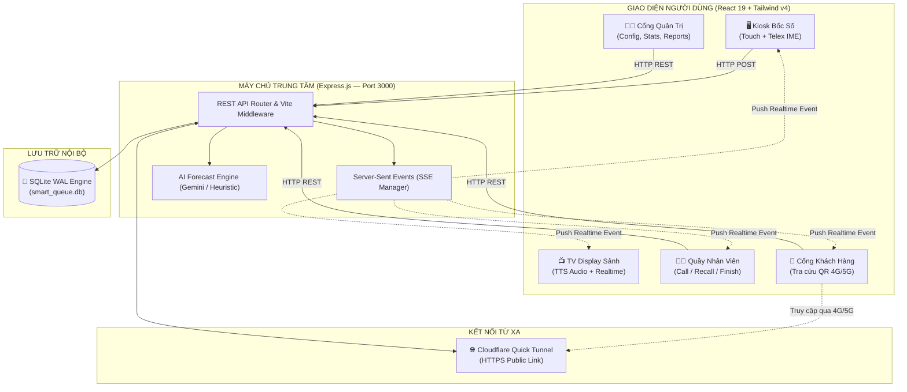
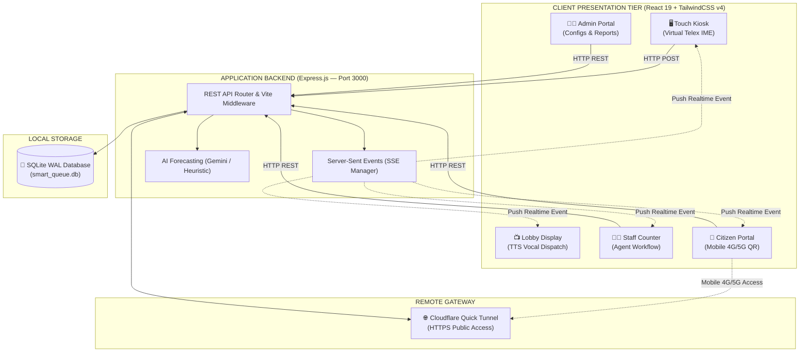

<div align="center">


# 🎫 SMART QUEUE SYSTEM
### Hệ Thống Bốc Số & Quản Lý Hàng Đợi Thông Minh Đa Ngành
**Enterprise-Grade Smart Queue & Citizen Dispatching Ecosystem**

<br/>

[](https://github.com)
[](LICENSE)
[](https://github.com)
[](https://github.com)

<br/>

> 💡 **Chuyển đổi ngôn ngữ / Language Selector:**  
> Nhấp vào thanh tiêu đề bên dưới để ẩn/hiện phiên bản **Tiếng Việt** hoặc **English**.  
> *Click on the headers below to expand or collapse Vietnamese or English versions.*

</div>

<br/>

---

<!-- ============================================================== -->
<!-- 🇻🇳 PHIÊN BẢN TIẾNG VIỆT (VIETNAMESE VERSION)                  -->
<!-- ============================================================== -->

<details open>
<summary><h2>🇻🇳 BẢN TIẾNG VIỆT (Mặc định — Nhấp vào đây để thu gọn hoặc mở rộng)</h2></summary>

<br/>

### 🎯 So Sánh: Hệ Thống Truyền Thống vs Smart Queue

| Tiêu chí | Hệ thống phần cứng truyền thống | 🎫 Smart Queue System |
| :--- | :--- | :--- |
| **Chi phí triển khai** | Hàng chục đến hàng trăm triệu (mua phần cứng chuyên dụng, bảng LED riêng) | **0 đồng phí bản quyền** — tận dụng máy tính, tablet, Smart TV có sẵn |
| **Cài đặt & Vận hành** | Phức tạp, cần kỹ sư cấu hình SQL Server, mạng dây RS485 | **1-Click khởi chạy** qua Launcher v5.0, SQLite WAL tự động không cần cài DB |
| **Âm thanh gọi số** | Giọng nhân tạo thô sơ hoặc bắt buộc thu âm từng số cố định | **Google TTS tiếng Việt chuẩn**, phát âm tự nhiên tên dịch vụ & số quầy |
| **Khách hàng theo dõi** | Phải ngồi cố định tại sảnh chờ nhìn bảng LED | **Quét QR bằng điện thoại (4G/5G)**, theo dõi số lượt chờ từ xa |
| **Ưu tiên phục vụ** | Bốc chung 1 luồng hoặc chia phím cơ cứng nhắc | **Tự động phân luồng Ưu tiên**: Người cao tuổi, Thai phụ, Khuyết tật, VIP |
| **Trí tuệ nhân tạo** | Không có | **Google Gemini AI Flash** phân tích tải, cảnh báo quá tải & điều phối quầy |
| **Khả năng mở rộng** | Giới hạn số cổng vật lý | Không giới hạn số quầy, số Kiosk, số màn hình TV trong mạng LAN/Cloud |

---

### 🌟 Tổng Quan Dự Án

**Smart Queue** là nền tảng quản trị hàng đợi thế hệ mới được thiết kế theo triết lý **"Zero-Config & All-in-One"**:

- 🏛️ **Cơ quan Hành chính công (Một cửa)**: UBND các cấp, Trung tâm Phục vụ Hành chính công, Công an giải quyết thủ tục CCCD/Hộ chiếu, Bộ phận Thuế, BHXH.
- 🏥 **Bệnh viện, Phòng khám & Y tế**: Tiếp đón phân luồng bệnh nhân, phòng khám chuyên khoa, xét nghiệm, chẩn đoán hình ảnh, cấp phát thuốc.
- 🏦 **Ngân hàng & Tổ chức Tài chính**: Giao dịch gửi/rút, tư vấn mở thẻ, dịch vụ tín dụng, quầy khách hàng doanh nghiệp & VIP.
- 🛒 **Bán lẻ, Dịch vụ & Trung tâm Bảo hành**: Siêu thị điện máy, cửa hàng viễn thông, showroom ô tô, trạm bảo dưỡng bảo hành.
- ✂️ **Thẩm mỹ, Spa & Salon**: Tiếp đón khách hàng theo lịch hẹn, tự động sắp xếp thứ tự ưu tiên chuyên viên.
- 🏫 **Trường Đại học & Giáo dục**: Phòng đào tạo, nộp hồ sơ xét tuyển, thư viện, bộ phận tài vụ sinh viên.

---

### ✨ Các Phân Hệ Chính

```
┌──────────────────────────────────────────────────────────────────────────────────┐
│                             6 PHÂN HỆ CỐT LÕI                                    │
├───────────────────┬───────────────────┬───────────────────┬──────────────────────┤
│ 🖥️ Kiosk Cảm Ứng   │ 📺 TV Display     │ 🧑‍💼 Staff Counter │ 👨‍💻 Admin Portal      │
│ Bốc số cảm ứng    │ Gọi số TV + TTS   │ Tiếp nhận & gọi   │ Quản trị & thống kê  │
├───────────────────┴───────────────────┼───────────────────┴──────────────────────┤
│ 📱 Citizen Portal (Web & 4G/5G)        │ 🤖 Gemini AI Smart Forecast              │
│ Tra cứu lượt & Đánh giá sao           │ Dự báo lưu lượng & Cảnh báo quá tải      │
└───────────────────────────────────────┴──────────────────────────────────────────┘
```

#### 1. 🖥️ Kiosk Bốc Số Cảm Ứng (`/?mode=kiosk`)
- **Màn hình cảm ứng hiện đại**: Giao diện thẻ dịch vụ lớn, trực quan, độ trễ phản hồi tức thời.
- **Phân loại đối tượng Ưu tiên (Priority Matrix)**:
  - 👵 **Người cao tuổi** (tự động ưu tiên gọi trước)
  - 🤰 **Phụ nữ mang thai / có con nhỏ**
  - ♿ **Người khuyết tật**
  - ⭐ **Khách hàng VIP / Doanh nghiệp**
- **Bàn phím ảo tiếng Việt thông minh**: Tích hợp bộ gõ **Telex & VNI** ngay trên màn hình cảm ứng, người dân nhập Họ tên / CCCD / SĐT mà không cần bàn phím ngoài.
- **In phiếu số & Tải ảnh kỹ thuật số**: Kết nối máy in nhiệt POS khổ 80mm/58mm hoặc xuất mã QR điện tử lưu về điện thoại.

#### 2. 📺 Màn Hình TV Sảnh Gọi Số (`/?mode=tv`)
- **Cập nhật tức thời qua Server-Sent Events (SSE)**: Không tải lại trang, không độ trễ.
- **Giọng đọc tiếng Việt tự nhiên (TTS)**: Đọc thông báo chuẩn:  
  *🔊 "Xin mời số phiếu [A105] đến quầy số [03] phục vụ..."*
- **Danh sách số đang phục vụ & Lượt chờ kế tiếp**: Phân màu tương phản cao, dễ quan sát từ khoảng cách 10m–20m.
- **Dải băng truyền thông & Banner thông báo**: Chạy thông điệp tuyên truyền của Đảng/Nhà nước, tin tức cơ quan, lịch nghỉ lễ, video giới thiệu đơn vị.

#### 3. 🧑‍💼 Bàn Làm Việc Nhân Viên Quầy (`/?mode=staff`)
- **Thao tác 1-Click**:
  - `Gọi tiếp` (Call Next): Tự động tính toán điểm ưu tiên + thời gian xếp hàng để gọi lượt tối ưu.
  - `Gọi lại` (Recall): Phát lại âm thanh hiệu triệu trên TV sảnh.
  - `Phục vụ` (Serving): Bấm giờ thời gian tiếp nhận thực tế để đánh giá KPI cán bộ.
  - `Hoàn thành` (Complete): Kết thúc lượt, lưu trữ dữ liệu lịch sử và chuyển sang lượt mới.
  - `Vắng mặt` (No Show): Tự động chuyển trạng thái khách bỏ lượt sau số lần gọi quy định.
  - `Chuyển quầy` (Transfer): Chuyển tiếp phiếu sang quầy/dịch vụ liên đới mà không bắt khách bốc số lại từ đầu.
- **Linh hoạt cấu hình**: Cán bộ tự đổi quầy ngồi hoặc chọn các nhóm dịch vụ mình phụ trách.

#### 4. 👨‍💻 Cổng Quản Trị Hệ Thống (`/?mode=admin`)
- **Quản lý Dịch vụ**: Thêm/sửa/xóa dịch vụ, cài đặt tiền tố mã số (`A`, `B`, `C`...), giới hạn số phiếu tối đa trong ngày, thời lượng phục vụ chuẩn.
- **Nạp mẫu dịch vụ 1-Click (Templates)**: Nạp ngay cây dịch vụ mẫu UBND cấp xã/phường, ngân hàng, hoặc phòng khám đa khoa.
- **Quản lý Quầy & Thiết bị**: Kiểm soát trạng thái mở/đóng của từng quầy, Kiosk và TV.
- **Báo cáo, Biểu đồ & Xuất CSV**: Biểu đồ phân bổ lượng khách theo khung giờ trong ngày, tỷ lệ hoàn thành/vắng mặt, xuất file báo cáo tương thích Excel (.csv).
- **Cài đặt Tên miền Public**: Dán URL Cloudflare Tunnel để tự động sinh mã QR 4G/5G.

#### 5. 📱 Cổng Công Dân / Khách Hàng (`/?mode=citizen`)
- **Lấy số từ xa**: Khách hàng mở link trên điện thoại để lấy số trước khi tới điểm giao dịch.
- **Theo dõi tiến trình trực tiếp**: Biết chính xác còn bao nhiêu người phía trước và thời gian ước tính đến lượt mình.
- **Đánh giá chất lượng phục vụ**: Khách hàng chấm điểm 1–5 sao và gửi nhận xét góp ý ngay sau khi hoàn tất thủ tục.

#### 6. 🤖 Trí Tuệ Nhân Tạo Dự Báo Lưu Lượng (`Google Gemini AI`)
- **Phân tích số liệu lịch sử**: Ứng dụng Gemini AI Flash dự báo nguy cơ quá tải theo từng khung giờ trong ngày.
- **Khuyến nghị điều phối**: Đưa ra gợi ý mở thêm quầy hoặc điều động nhân lực dự phòng.
- **Heuristic Engine Fallback**: Tự động chuyển sang mô hình thuật toán nội bộ nếu không có mạng Internet.

---

### 🚀 Khởi Chạy 1-Click: Launcher v5.0

> [!TIP]
> **Khuyên dùng cho Windows:** Chỉ cần nhấp đúp file **`SmartQueue_Launcher_v5.bat`** tại thư mục gốc. Hệ thống tự động làm mọi việc từ A đến Z!

```text
  ========================================================================
                          SMARTQUEUE DA SAN SANG
  ========================================================================

    [+] LOCAL:      http://localhost:3000
    [+] INTERNET:   https://lines-beef-mystery-headline.trycloudflare.com

    [*] LINK INTERNET DA DUOC TU DONG COPY VAO CLIPBOARD
  ========================================================================
```

#### ⚙️ Cơ Chế Tự Động Hóa Của Launcher v5.0:
1. **Kiểm tra môi trường**: Tự động kiểm tra `Node.js`, `npm`, tự chạy `npm install` nếu chưa cài dependencies.
2. **Khởi tạo môi trường**: Tự động tạo `.env.local` nếu thiếu.
3. **Giải phóng cổng 3000**: Nếu có tiến trình chiếm giữ cổng `3000`, script tự động giải phóng PID để tránh xung đột.
4. **Khởi động Backend**: Chạy ngầm máy chủ Express + Vite trong một tiến trình con ổn định.
5. **Kích hoạt Cloudflare Quick Tunnel**:
   - Tự dò tìm `cloudflared.exe` (trong `tools\`, `Program Files`, `Program Files (x86)`, WinGet, LocalAppData).
   - Nếu máy chưa có, tự động tải bản chính thức từ Cloudflare về thư mục `tools\`.
   - Tạo đường truyền HTTPS công khai bảo mật hoàn toàn miễn phí (không cần mở cổng Modem).
6. **Bắt URL & Copy Clipboard**: Tự động nhận diện URL `https://*.trycloudflare.com` và nạp sẵn vào bộ nhớ tạm (Clipboard) của bạn.
7. **Khởi chạy trình duyệt**: Tự động mở Microsoft Edge / Google Chrome ở chế độ cửa sổ độc lập.

---

### 🏗️ Kiến Trúc Hệ Thống



---

### 💻 Hướng Dẫn Cài Đặt

#### Cách 1: Chạy Bằng Command Line (Cross-Platform)

```bash
# 1. Clone mã nguồn dự án
git clone https://github.com/your-username/smart-queue.git
cd smart-queue

# 2. Cài đặt thư viện dependencies
npm install

# 3. Tạo file cấu hình môi trường
copy .env.example .env.local   # Trên Windows
cp .env.example .env.local     # Trên macOS / Linux

# 4. Khởi chạy môi trường phát triển (Development)
npm run dev
```
Truy cập: **`http://localhost:3000`**

#### Cách 2: Chạy Môi Trường Production Tối Ưu

```bash
# Build đóng gói bundle frontend & server
npm run build

# Khởi chạy production server (tối ưu RAM & tốc độ)
npm start
```

#### Cách 3: Đóng Gói Thành Phần Mềm Desktop Windows (.exe)

```bash
# Kiểm tra chạy thử app desktop
npm run electron:dev

# Đóng gói tạo file cài đặt Windows (.exe installer & portable)
npm run electron:build
```
*Tệp cài đặt đầu ra sẽ nằm tại thư mục `dist_electron/`.*

---

### ⚙️ Cấu Hình Môi Trường (`.env.local`)

```env
# Cổng chạy ứng dụng (Mặc định: 3000)
PORT=3000

# Khóa API Google Gemini để kích hoạt trí tuệ nhân tạo dự báo
# Đăng ký miễn phí tại: https://aistudio.google.com/apikey
GEMINI_API_KEY=AIzaSyYourGeminiApiKeyHere

# Đường dẫn công khai cố định (Tùy chọn, để trống nếu dùng Cloudflare Tunnel tự động)
APP_URL=

# Cấu hình Supabase (Tùy chọn nếu cần tích hợp đồng bộ đám mây)
VITE_SUPABASE_URL=
VITE_SUPABASE_PUBLISHABLE_KEY=
```

---

### 📡 API Reference

<details>
<summary><b>🔐 Xác thực & Người dùng (Authentication & Users)</b></summary>

| Method | Endpoint | Chức năng |
| :--- | :--- | :--- |
| `POST` | `/api/auth/login` | Đăng nhập hệ thống (username, password, role) |
| `GET` | `/api/users` | Lấy danh sách tài khoản nhân viên |
| `POST` | `/api/users` | Tạo tài khoản nhân sự mới |
| `PUT` | `/api/users/:id` | Cập nhật thông tin / mật khẩu tài khoản |
| `DELETE`| `/api/users/:id` | Xóa tài khoản nhân sự |

</details>

<details>
<summary><b>🛎️ Quản lý Dịch vụ & Quầy (Services & Counters)</b></summary>

| Method | Endpoint | Chức năng |
| :--- | :--- | :--- |
| `GET` | `/api/services` | Danh sách dịch vụ đang mở |
| `POST` | `/api/services` | Tạo dịch vụ mới (tiền tố, tên, giới hạn số, thời lượng) |
| `PUT` | `/api/services/:id` | Chỉnh sửa dịch vụ |
| `DELETE`| `/api/services/:id` | Xóa dịch vụ |
| `POST` | `/api/services/templates`| Nạp bộ mẫu dịch vụ nhanh (`GOVERNMENT` / `ENTERPRISE`) |
| `GET` | `/api/counters` | Danh sách quầy giao dịch |
| `PUT` | `/api/counters/:id` | Cập nhật trạng thái / cấu hình quầy |

</details>

<details>
<summary><b>🎫 Nghiệp vụ Phiếu số & Cán bộ (Tickets & Staff Operations)</b></summary>

| Method | Endpoint | Chức năng |
| :--- | :--- | :--- |
| `GET` | `/api/tickets` | Danh sách phiếu số trong ngày |
| `POST` | `/api/tickets/issue` | Bốc số phiếu mới (chọn dịch vụ, thông tin, đối tượng ưu tiên) |
| `GET` | `/api/tickets/token/:token`| Tra cứu tiến độ lượt theo token bảo mật |
| `POST` | `/api/tickets/:token/rating`| Đánh giá số sao (1–5 sao) và gửi góp ý |
| `POST` | `/api/staff/call-next` | Gọi số tiếp theo (ưu tiên thuật toán điểm số) |
| `POST` | `/api/staff/recall` | Gọi lại số đang phục vụ |
| `POST` | `/api/staff/start-serving`| Bắt đầu tính giờ phục vụ thực tế |
| `POST` | `/api/staff/complete` | Hoàn thành lượt tiếp nhận |
| `POST` | `/api/staff/no-show` | Báo vắng mặt khách hàng |
| `POST` | `/api/staff/transfer` | Chuyển phiếu sang quầy/dịch vụ khác |

</details>

<details>
<summary><b>🤖 AI, Realtime & Báo cáo (AI, Realtime & Analytics)</b></summary>

| Method | Endpoint | Chức năng |
| :--- | :--- | :--- |
| `GET` | `/api/events` | Luồng **Server-Sent Events (SSE)** nhận cập nhật tức thời |
| `GET` | `/api/ai/forecast` | Dự báo lưu lượng cao điểm & khuyến nghị điều phối |
| `GET` | `/api/tts?text=...` | API Text-To-Speech giọng đọc tiếng Việt |
| `GET` | `/api/reports/stats` | Thống kê số lượng bốc, đã phục vụ, đang chờ, vắng |
| `GET` | `/api/reports/export-csv` | Xuất toàn bộ dữ liệu lịch sử ra file CSV Excel |

</details>

---

### 👥 Phân Quyền & Tài Khoản Mặc Định

| Tên Đăng Nhập | Mật Khẩu Mặc Định | Vai Trò | Quyền Hạn |
| :--- | :--- | :--- | :--- |
| **`admin`** | `admin123` | **ADMIN** | Quản trị toàn hệ thống, cấu hình dịch vụ, quầy, nhân sự và xem báo cáo |
| **`staff01`** | `staff123` | **STAFF** | Thao tác tiếp nhận, gọi số tại quầy được phân công |

---

### 📁 Cấu Trúc Mã Nguồn

```text
smart-queue/
├── 📄 SmartQueue_Launcher_v5.bat  # Trình khởi động 1-Click thông minh (Local + Cloudflare)
├── 📄 server.ts                   # Entry point máy chủ Express API & Vite Middleware
├── 📄 vite.config.ts              # Cấu hình Vite bundler, Tailwind v4 và allowedHosts
├── 📄 package.json                # Danh mục dependencies và scripts
├── 📄 tsconfig.json               # Cấu hình trình biên dịch TypeScript
│
├── 📁 server/                     # Backend Server Engine
│   ├── 📄 db.ts                   # CSDL SQLite (Schema, CRUD Services, Tickets, Counters)
│   ├── 📄 ai.ts                   # Tích hợp Google Gemini AI và mô hình dự báo Heuristic
│   └── 📄 sse.ts                  # Bộ điều phối sự kiện thời gian thực Server-Sent Events
│
├── 📁 src/                        # Ứng dụng Frontend React 19
│   ├── 📄 main.tsx                # Khởi tạo React Virtual DOM
│   ├── 📄 App.tsx                 # Router phân luồng giao diện (?mode=)
│   ├── 📄 index.css               # Styling hệ thống chuẩn TailwindCSS v4
│   │
│   ├── 📁 components/             # Các phân hệ giao diện chính
│   │   ├── 📄 KioskMode.tsx       # Màn hình Kiosk cấp số cảm ứng
│   │   ├── 📄 TvDisplay.tsx       # Màn hình TV sảnh chờ gọi số
│   │   ├── 📄 StaffCounter.tsx    # Giao diện cán bộ tiếp nhận tại quầy
│   │   ├── 📄 AdminPortal.tsx     # Cổng quản trị trung tâm đa chức năng
│   │   ├── 📄 CitizenPortal.tsx   # Cổng trực tuyến cho công dân lấy số từ xa
│   │   ├── 📄 VirtualKeyboard.tsx # Bàn phím ảo hỗ trợ gõ tiếng Việt Telex/VNI
│   │   ├── 📄 TicketPrintModal.tsx# Giao diện in phiếu số & hiển thị mã QR
│   │   └── 📄 PwaInstallPrompt.tsx# Trợ lý cài đặt PWA App độc lập
│   │
│   ├── 📁 types/                  # Định nghĩa kiểu dữ liệu TypeScript
│   │   └── 📄 queue.ts            # Data models (Ticket, Service, Counter, User, Org)
│   │
│   └── 📁 utils/                  # Tiện ích bổ trợ
│       ├── 📄 audio.ts            # Bộ phát âm thanh Google TTS tiếng Việt
│       ├── 📄 ticketImageGenerator.ts # Trình xuất ảnh phiếu số để khách tải về
│       └── 📄 vietnameseIME.ts    # Bộ engine xử lý dấu tiếng Việt
│
├── 📁 electron/                   # Đóng gói Desktop App
│   ├── 📄 main.cjs                # Tiến trình chính Electron
│   └── 📄 preload.cjs             # Cầu nối IPC bảo mật
│
├── 📁 scripts/                    # Scripts tự động hóa tiện ích
│   └── 📄 setup-cloudflare-tunnel.bat # Script chạy độc lập Cloudflare Tunnel
│
├── 📁 data/                       # Thư mục lưu trữ database SQLite (smart_queue.db)
└── 📁 tools/                      # Thư mục chứa binary cloudflared.exe
```

---

### 🛠️ FAQ & Troubleshooting

<details>
<summary><b>1. Cổng 3000 bị báo lỗi "Port 3000 is already in use"?</b></summary>
<br/>

Khởi động lại bằng file `SmartQueue_Launcher_v5.bat`. Launcher v5 đã được tích hợp bộ dò tìm PID tự động, phát hiện và tắt ngay các ứng dụng đang chiếm giữ cổng 3000 để nhường quyền cho Smart Queue.
</details>

<details>
<summary><b>2. Màn hình TV Display không phát âm thanh gọi số?</b></summary>
<br/>

Do chính sách **Autoplay Policy** trên các trình duyệt hiện đại (Chrome, Edge), âm thanh bị tạm khóa cho đến khi người dùng có tương tác đầu tiên. Khi mở màn hình TV (`/?mode=tv`), bạn chỉ cần click chuột một lần vào bất kỳ đâu trên màn hình TV để mở khóa âm thanh.
</details>

<details>
<summary><b>3. Khách hàng dùng 4G quét mã QR trên phiếu bị báo lỗi không tải được trang?</b></summary>
<br/>

Nguyên nhân do URL Public trong hệ thống đang để mặc định `localhost` (chỉ máy chủ xem được).  
**Cách xử lý:** Chạy `SmartQueue_Launcher_v5.bat` để nhận link Cloudflare Tunnel (ví dụ: `https://xxxx.trycloudflare.com`), sau đó đăng nhập Admin (`/?mode=admin`) ➔ Tab **Cài đặt Hệ thống** ➔ Dán link vào ô **Tên miền / URL Public** ➔ Bấm **Lưu cấu hình**. Tất cả phiếu in ra sau đó sẽ quét được bằng 4G/5G bình thường.
</details>

<details>
<summary><b>4. Các máy tính khác trong mạng Wi-Fi/LAN không truy cập được vào máy chủ?</b></summary>
<br/>

Nguyên nhân do tường lửa Windows (Windows Defender Firewall) chặn kết nối vào.  
**Cách xử lý:** Vào **Windows Defender Firewall** ➔ **Advanced Settings** ➔ **Inbound Rules** ➔ Tạo New Rule cho phép cổng **TCP 3000** đi qua. Sau đó các máy khác có thể truy cập qua địa chỉ IP của máy chủ: `http://192.168.x.x:3000`.
</details>

</details>

<br/>
<hr style="border: 1px solid #334155; margin: 30px 0;" />
<br/>

<!-- ============================================================== -->
<!-- 🇬🇧 PHIÊN BẢN TIẾNG ANH (ENGLISH VERSION)                      -->
<!-- ============================================================== -->

<details>
<summary><h2>🇬🇧 ENGLISH VERSION (Click here to expand or collapse)</h2></summary>

<br/>

### 🎯 Comparison: Traditional Hardware Systems vs Smart Queue

| Criteria | Traditional Hardware Queue Systems | 🎫 Smart Queue System |
| :--- | :--- | :--- |
| **Deployment Cost** | Thousands of dollars (proprietary hardware, dedicated LED panels, controllers) | **$0 software licensing fee** — run on any existing PC, tablet, or Smart TV |
| **Installation & Maintenance** | Complex setup, dedicated database servers (SQL Server/Oracle), RS485 wiring | **1-Click launcher**, zero-config embedded SQLite WAL database engine |
| **Voice Calling** | Monotone robotic buzzer or rigid pre-recorded voice clips | **Natural Vietnamese TTS voice (Google TTS)**, fluent calling of ticket & counter |
| **Customer Tracking** | Trapped in the waiting hall staring at fixed LED boards | **Scan QR via 4G/5G mobile**, track remaining queue position remotely |
| **Priority Handling** | Single stream or cumbersome mechanical keypads | **Automated 4-tier Priority Matrix**: Seniors, Pregnant Women, Disabled, VIP |
| **AI Analytics** | None | **Google Gemini AI Flash** flow forecasting, bottleneck detection & staff dispatch |
| **Scalability** | Fixed physical port limits | Unlimited counters, kiosks, and TV displays across LAN and Cloud |

---

### 🌟 Project Overview

**Smart Queue** is a modern, modular queue dispatching and citizen service platform engineered with a **"Zero-Config & All-in-One"** philosophy:

- 🏛️ **Public Administration & Government Centers**: One-Stop Public Service Centers, Citizen Identity / Passport bureaus, Tax offices, Social Security agencies.
- 🏥 **Hospitals, Clinics & Healthcare**: Patient triage, specialized outpatient clinics, laboratory test queues, pharmacy counters.
- 🏦 **Banking & Financial Institutions**: Deposit/withdrawal counters, credit advisory, card issuance, VIP and corporate accounts.
- 🛒 **Retail, Telecommunications & Service Centers**: Electronics retail, mobile carrier stores, automotive service centers, warranty hubs.
- ✂️ **Aesthetics, Spas & Salons**: Appointment check-in, automated therapist dispatch, client priority routing.
- 🏫 **Universities & Educational Facilities**: Admissions offices, student affairs, academic registrar, campus library desks.

---

### ✨ Core Modules

```
┌──────────────────────────────────────────────────────────────────────────────────┐
│                                6 CORE SUBSYSTEMS                                 │
├───────────────────┬───────────────────┬───────────────────┬──────────────────────┤
│ 🖥️ Kiosk Mode      │ 📺 Display TV     │ 🧑‍💼 Staff Counter │ 👨‍💻 Admin Portal      │
│ Touch Ticketing   │ Vocal Call & Info │ Agent Workflow    │ Config & Analytics   │
├───────────────────┴───────────────────┼───────────────────┴──────────────────────┤
│ 📱 Citizen Portal (Mobile 4G/5G)       │ 🤖 Gemini AI Smart Forecast              │
│ Remote Queuing & Feedback             │ Traffic Prediction & Overload Alerts     │
└───────────────────────────────────────┴──────────────────────────────────────────┘
```

#### 1. 🖥️ Touchscreen Kiosk (`/?mode=kiosk`)
- **Modern Touch-First UX**: Responsive card layout, zero-latency interactions.
- **Multi-Level Priority Routing Matrix**:
  - 👵 **Senior Citizens** (automated priority bump)
  - 🤰 **Expectant Mothers / Parents with Infants**
  - ♿ **Persons with Disabilities**
  - ⭐ **VIP / Corporate Clients**
- **Built-in Virtual Vietnamese Keyboard**: Native **Telex & VNI** input method engine directly on touchscreen with no physical keyboard required.
- **Flexible Ticket Issuance**: Direct printing via ESC/POS thermal printers (80mm/58mm) or instant digital ticket generation with downloadable ticket image.

#### 2. 📺 Lobby TV Display (`/?mode=tv`)
- **Zero-Latency Real-Time Updates**: Powered by **Server-Sent Events (SSE)**.
- **Natural Vietnamese Audio Calling (TTS)**:  
  *🔊 "Calling ticket number [A105] to Counter [03] please..."*
- **High-Contrast Multi-Zone Display**: Active serving tickets alongside upcoming waitlist, easily readable from 10–20 meters away.
- **Media Ticker & Public Announcements**: Real-time clock, emergency broadcast notices, public guidelines, or institutional video banners.

#### 3. 🧑‍💼 Staff Counter Dashboard (`/?mode=staff`)
- **1-Click Agent Actions**:
  - `Call Next`: Intelligent dispatch based on priority score and waiting duration.
  - `Recall`: Re-broadcast voice alert on lobby TV display.
  - `Start Serving`: Real-time service timer to measure agent performance (KPI).
  - `Complete`: Mark ticket fulfilled and archive transaction logs.
  - `No-Show`: Auto-expire absent tickets after designated recall limits.
  - `Transfer`: Route ticket to another department or counter without losing queue place.
- **Dynamic Counter Re-assignment**: Agents can freely change counters or take charge of multiple service queues on the fly.

#### 4. 👨‍💻 Admin Management Portal (`/?mode=admin`)
- **Service Queue Configuration**: Create/edit services, ticket prefixes (`A`, `B`, `C`...), daily quota caps, and estimated service times.
- **1-Click Industry Templates**: Pre-configured service trees for Government Administration, Banking, and Healthcare.
- **Counter & Device Management**: Monitor active states of all counters, kiosks, and display monitors.
- **Analytics, Charts & CSV Export**: Hourly traffic distribution, completion vs. no-show ratios, average wait times, and Excel-compatible CSV export.
- **Public Domain Setup**: Paste Cloudflare Tunnel URLs to generate live 4G/5G customer QR codes.

#### 5. 📱 Citizen / Customer Portal (`/?mode=citizen`)
- **Remote Mobile Queuing**: Customers can select services and draw queue tickets from their smartphones before arriving.
- **Live Queue Position Tracker**: Real-time display of remaining parties ahead and estimated arrival time.
- **Quality Feedback Rating**: 1 to 5 star rating submission with custom review comments upon service completion.

#### 6. 🤖 AI Traffic Forecasting (`Google Gemini AI`)
- **Historical Queue Analytics**: Uses Google Gemini Flash AI to predict potential peak-hour bottlenecks throughout the operating day.
- **Actionable Dispatch Advice**: Recommends opening additional counters or reallocating counter staff ahead of traffic spikes.
- **Built-in Heuristic Fallback**: Seamlessly switches to an offline mathematical model when no Internet connection or API key is provided.

---

### 🚀 1-Click Launcher: Launcher v5.0

> [!TIP]
> **Recommended for Windows:** Simply double-click **`SmartQueue_Launcher_v5.bat`** in the project root directory. Everything launches automatically!

```text
  ========================================================================
                          SMARTQUEUE IS READY
  ========================================================================

    [+] LOCAL:      http://localhost:3000
    [+] INTERNET:   https://lines-beef-mystery-headline.trycloudflare.com

    [*] PUBLIC LINK AUTOMATICALLY COPIED TO CLIPBOARD
  ========================================================================
```

#### ⚙️ Automated Features of Launcher v5.0:
1. **Environment Verification**: Auto-detects `Node.js` and `npm`, auto-runs `npm install` if dependencies are missing.
2. **Configuration Bootstrap**: Creates `.env.local` automatically if absent.
3. **Port 3000 Conflict Resolution**: Detects and cleanly frees port `3000` if occupied by stale processes.
4. **Resilient Background Server**: Runs the Express + Vite server in a dedicated background window.
5. **Integrated Cloudflare Quick Tunnel**:
   - Searches for `cloudflared.exe` across local folders, WinGet, and Program Files.
   - Automatically downloads the official binary to `tools\` if not already installed.
   - Provisions an instant, encrypted HTTPS public tunnel (no modem port forwarding required).
6. **Instant Clipboard Sync**: Parses the generated `trycloudflare.com` URL and copies it directly to your clipboard.
7. **App Window Launch**: Opens Microsoft Edge or Google Chrome in standalone application window mode.

---

### 🏗️ System Architecture



---

### 💻 Installation & Quick Start

#### Method 1: Command Line Interface (Cross-Platform)

```bash
# 1. Clone repository
git clone https://github.com/your-username/smart-queue.git
cd smart-queue

# 2. Install dependencies
npm install

# 3. Create local environment configuration
copy .env.example .env.local   # On Windows
cp .env.example .env.local     # On macOS / Linux

# 4. Launch development server
npm run dev
```
Open your browser at: **`http://localhost:3000`**

#### Method 2: High-Performance Production Server

```bash
# Build optimized frontend bundle and server distribution
npm run build

# Start production server (lowest RAM consumption)
npm start
```

#### Method 3: Standalone Windows Desktop App (.exe)

```bash
# Run desktop app in development
npm run electron:dev

# Package into Windows installer (.exe) & portable binary
npm run electron:build
```
*Generated installer files will be located in `dist_electron/`.*

---

### ⚙️ Environment Variables (`.env.local`)

```env
# Application listening port (Default: 3000)
PORT=3000

# Google Gemini API Key for intelligent queue forecasting
# Obtain a free API key at: https://aistudio.google.com/apikey
GEMINI_API_KEY=AIzaSyYourGeminiApiKeyHere

# Fixed public URL (Optional; leave blank if using Cloudflare Quick Tunnel)
APP_URL=

# Supabase integration (Optional cloud synchronization)
VITE_SUPABASE_URL=
VITE_SUPABASE_PUBLISHABLE_KEY=
```

---

### 📡 API Reference

<details>
<summary><b>🔐 Authentication & User Accounts</b></summary>

| Method | Endpoint | Description |
| :--- | :--- | :--- |
| `POST` | `/api/auth/login` | System login (username, password, role) |
| `GET` | `/api/users` | List staff accounts |
| `POST` | `/api/users` | Create staff account |
| `PUT` | `/api/users/:id` | Update staff details / credentials |
| `DELETE`| `/api/users/:id` | Remove staff account |

</details>

<details>
<summary><b>🛎️ Services & Counter Management</b></summary>

| Method | Endpoint | Description |
| :--- | :--- | :--- |
| `GET` | `/api/services` | Retrieve active services list |
| `POST` | `/api/services` | Create new service (prefix, quota, duration) |
| `PUT` | `/api/services/:id` | Update service definition |
| `DELETE`| `/api/services/:id` | Remove service |
| `POST` | `/api/services/templates`| Load quick templates (`GOVERNMENT` / `ENTERPRISE`) |
| `GET` | `/api/counters` | List service counters |
| `PUT` | `/api/counters/:id` | Update counter status and services |

</details>

<details>
<summary><b>🎫 Tickets & Agent Operations</b></summary>

| Method | Endpoint | Description |
| :--- | :--- | :--- |
| `GET` | `/api/tickets` | Retrieve today's ticket logs |
| `POST` | `/api/tickets/issue` | Issue new ticket (service, party details, priority) |
| `GET` | `/api/tickets/token/:token`| Query ticket queue status by secure token |
| `POST` | `/api/tickets/:token/rating`| Submit star rating (1–5) and review comment |
| `POST` | `/api/staff/call-next` | Dispatch next prioritized ticket |
| `POST` | `/api/staff/recall` | Re-announce current ticket on lobby TV |
| `POST` | `/api/staff/start-serving`| Start real-time service timer |
| `POST` | `/api/staff/complete` | Conclude service and log completion |
| `POST` | `/api/staff/no-show` | Mark party absent |
| `POST` | `/api/staff/transfer` | Transfer ticket to another counter/service |

</details>

<details>
<summary><b>🤖 AI, Real-Time Streams & Reports</b></summary>

| Method | Endpoint | Description |
| :--- | :--- | :--- |
| `GET` | `/api/events` | **Server-Sent Events (SSE)** real-time update stream |
| `GET` | `/api/ai/forecast` | Gemini AI peak-hour traffic forecast & suggestions |
| `GET` | `/api/tts?text=...` | Text-To-Speech audio stream for vocal dispatch |
| `GET` | `/api/reports/stats` | Aggregate metrics (issued, served, waiting, no-show) |
| `GET` | `/api/reports/export-csv` | Export entire transaction history as CSV |

</details>

---

### 👥 Roles & Default Credentials

| Username | Default Password | Role | Permissions |
| :--- | :--- | :--- | :--- |
| **`admin`** | `admin123` | **ADMIN** | Full system configuration, service trees, staff accounts, and analytics |
| **`staff01`** | `staff123` | **STAFF** | Queue dispatching and ticket handling at assigned counter |

---

### 📁 Project Structure

```text
smart-queue/
├── 📄 SmartQueue_Launcher_v5.bat  # 1-Click launcher (Local + Cloudflare Quick Tunnel)
├── 📄 server.ts                   # Express.js server entry point & Vite middleware
├── 📄 vite.config.ts              # Vite bundler, Tailwind v4 and host whitelist configs
├── 📄 package.json                # Dependencies and npm scripts
├── 📄 tsconfig.json               # TypeScript compiler options
│
├── 📁 server/                     # Backend Server Engine
│   ├── 📄 db.ts                   # SQLite WAL database layer (Schema, CRUD, Queries)
│   ├── 📄 ai.ts                   # Google Gemini AI integration & Heuristic forecast
│   └── 📄 sse.ts                  # Server-Sent Events manager for realtime push
│
├── 📁 src/                        # Frontend Application (React 19)
│   ├── 📄 main.tsx                # React DOM entry point
│   ├── 📄 App.tsx                 # Route multiplexer by query param (?mode=)
│   ├── 📄 index.css               # Global styles powered by TailwindCSS v4
│   │
│   ├── 📁 components/             # Subsystem components
│   │   ├── 📄 KioskMode.tsx       # Touchscreen kiosk ticket dispenser
│   │   ├── 📄 TvDisplay.tsx       # Lobby display with voice announcements
│   │   ├── 📄 StaffCounter.tsx    # Agent counter management interface
│   │   ├── 📄 AdminPortal.tsx     # Centralized administration portal
│   │   ├── 📄 CitizenPortal.tsx   # Mobile portal for remote ticket booking
│   │   ├── 📄 VirtualKeyboard.tsx # Onscreen virtual keyboard with Telex/VNI IME
│   │   ├── 📄 TicketPrintModal.tsx# Thermal print preview & QR code generator
│   │   └── 📄 PwaInstallPrompt.tsx# Progressive Web App installation wizard
│   │
│   ├── 📁 types/                  # TypeScript data interfaces
│   │   └── 📄 queue.ts            # Data models (Ticket, Service, Counter, User, Org)
│   │
│   └── 📁 utils/                  # Helper utilities
│       ├── 📄 audio.ts            # Audio synthesizer for Google TTS
│       ├── 📄 ticketImageGenerator.ts # Canvas generator for downloadable tickets
│       └── 📄 vietnameseIME.ts    # Vietnamese diacritic input engine
│
├── 📁 electron/                   # Desktop App Wrapper
│   ├── 📄 main.cjs                # Electron main process
│   └── 📄 preload.cjs             # IPC security bridge
│
├── 📁 scripts/                    # Automation utilities
│   └── 📄 setup-cloudflare-tunnel.bat # Standalone Cloudflare Tunnel script
│
├── 📁 data/                       # Embedded SQLite database storage (smart_queue.db)
└── 📁 tools/                      # Official binary storage for cloudflared.exe
```

---

### 🛠️ Troubleshooting & FAQ

<details>
<summary><b>1. "Port 3000 is already in use" error?</b></summary>
<br/>

Launch the application using `SmartQueue_Launcher_v5.bat`. Launcher v5 features automated PID conflict resolution that identifies and frees port 3000 automatically before booting the server.
</details>

<details>
<summary><b>2. TV Display does not play vocal announcements automatically?</b></summary>
<br/>

Modern web browsers (Chrome, Edge) enforce an **Autoplay Security Policy** that mutes audio until user interaction occurs. When opening the TV display (`/?mode=tv`), simply click once anywhere on the screen to permit audio playback.
</details>

<details>
<summary><b>3. Customers cannot open the QR code link on their mobile 4G/5G?</b></summary>
<br/>

This happens when the Public URL is set to `localhost` (which cannot be reached from outside the server).  
**Solution:** Launch via `SmartQueue_Launcher_v5.bat` to obtain an instant Cloudflare Tunnel URL (e.g., `https://xxxx.trycloudflare.com`). Log in to **Admin** (`/?mode=admin`) ➔ **Settings** ➔ Paste the URL into **Public Domain / URL** ➔ Click **Save Configuration**. All newly generated QR codes will be reachable via 4G/5G.
</details>

<details>
<summary><b>4. Other PCs in the local Wi-Fi/LAN network cannot connect to the server?</b></summary>
<br/>

Windows Defender Firewall may be blocking incoming TCP traffic on port 3000.  
**Solution:** Open **Windows Defender Firewall** ➔ **Advanced Settings** ➔ **Inbound Rules** ➔ Create a New Rule allowing **TCP Port 3000**. Client machines can now connect using the host IP: `http://192.168.x.x:3000`.
</details>

</details>

<br/>

---

<div align="center">

## ⭐ Ủng Hộ Dự Án / Support the Project

Nếu bạn thấy **Smart Queue** hữu ích cho cơ quan hoặc doanh nghiệp của mình, hãy tặng dự án một **Star** trên GitHub để ủng hộ đội ngũ phát triển!  
*If **Smart Queue** is helpful for your organization, please give us a **Star** on GitHub to support active development!*

<br/>

**Smart Queue — Đưa Sự Thông Minh Vào Hàng Đợi / Bringing Intelligence to Queue Management**  
*Phát triển với ❤️ vì một nền hành chính và dịch vụ hiện đại*

</div>
