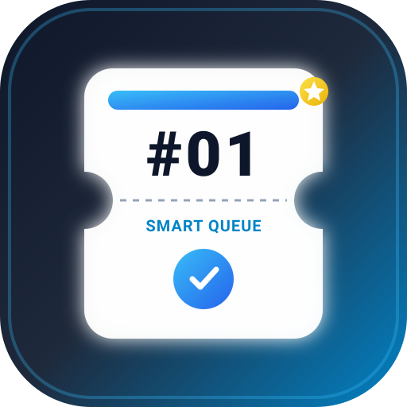
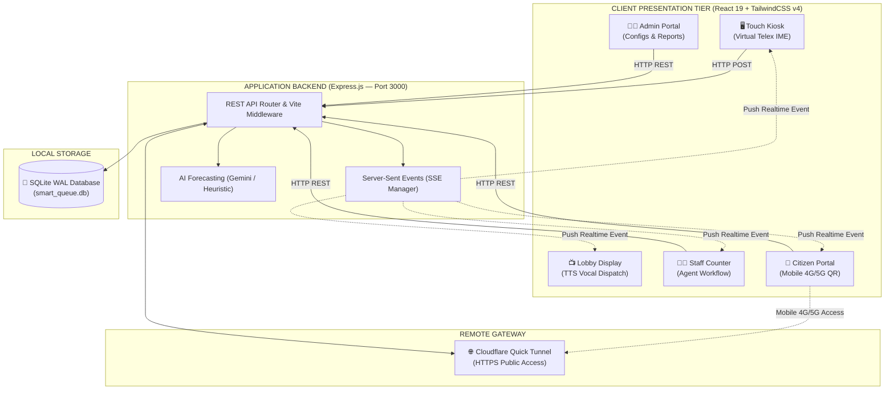

<div align="center">



# 🎫 SMART QUEUE SYSTEM
### Enterprise-Grade Smart Queue & Citizen Dispatching Ecosystem

**A complete digital transformation solution for Public Administration, Healthcare, Banking, Retail, and Customer Services**

<br/>

<!-- LANGUAGE SWITCHER -->
| 🌐 Select Language / Chọn ngôn ngữ hiển thị |
| :---: |
| [](./README.md) &nbsp;&nbsp;&nbsp;&nbsp; [-0284c7?style=for-the-badge)](#) |

<br/>

[](https://github.com)
[](LICENSE)
[](https://github.com)
[](https://github.com)

<p align="center">
  <a href="#-project-overview">Overview</a> •
  <a href="#-core-modules">Core Modules</a> •
  <a href="#-1-click-launcher-v50">Launcher v5.0</a> •
  <a href="#-system-architecture">Architecture</a> •
  <a href="#-installation--quick-start">Quick Start</a> •
  <a href="#-api-reference">API Reference</a> •
  <a href="#-troubleshooting--faq">FAQ</a>
</p>

---

</div>

<br/>

## 🎯 Comparison: Traditional Hardware Systems vs Smart Queue

| Criteria | Traditional Hardware Queue Systems | 🎫 Smart Queue System |
| :--- | :--- | :--- |
| **Deployment Cost** | Thousands of dollars (proprietary hardware, dedicated LED panels, controllers) | **$0 software licensing fee** — run on any existing PC, tablet, or Smart TV |
| **Installation & Maintenance** | Complex setup, dedicated database servers (SQL Server/Oracle), RS485 wiring | **1-Click launcher**, zero-config embedded SQLite WAL database engine |
| **Voice Calling** | Monotone robotic buzzer or rigid pre-recorded voice clips | **Natural Vietnamese TTS voice (Google TTS)**, fluent calling of ticket & counter |
| **Customer Tracking** | Trapped in the waiting hall staring at fixed LED boards | **Scan QR via 4G/5G mobile**, track remaining queue position remotely |
| **Priority Handling** | Single stream or cumbersome mechanical keypads | **Automated 4-tier Priority Matrix**: Seniors, Pregnant Women, Disabled, VIP |
| **AI Analytics** | None | **Google Gemini AI Flash** flow forecasting, bottleneck detection & staff dispatch |
| **Scalability** | Fixed physical port limits | Unlimited counters, kiosks, and TV displays across LAN and Cloud |

---

## 🌟 Project Overview

**Smart Queue** is a modern, modular queue dispatching and citizen service platform engineered with a **"Zero-Config & All-in-One"** philosophy:

- 🏛️ **Public Administration & Government Centers**: One-Stop Public Service Centers, Citizen Identity / Passport bureaus, Tax offices, Social Security agencies.
- 🏥 **Hospitals, Clinics & Healthcare**: Patient triage, specialized outpatient clinics, laboratory test queues, pharmacy counters.
- 🏦 **Banking & Financial Institutions**: Deposit/withdrawal counters, credit advisory, card issuance, VIP and corporate accounts.
- 🛒 **Retail, Telecommunications & Service Centers**: Electronics retail, mobile carrier stores, automotive service centers, warranty hubs.
- ✂️ **Aesthetics, Spas & Salons**: Appointment check-in, automated therapist dispatch, client priority routing.
- 🏫 **Universities & Educational Facilities**: Admissions offices, student affairs, academic registrar, campus library desks.

---

## ✨ Core Modules

<div align="center">

```
┌──────────────────────────────────────────────────────────────────────────────────┐
│                                6 CORE SUBSYSTEMS                                 │
├───────────────────┬───────────────────┬───────────────────┬──────────────────────┤
│ 🖥️ Kiosk Mode      │ 📺 Display TV     │ 🧑‍💼 Staff Counter │ 👨‍💻 Admin Portal      │
│ Touch Ticketing   │ Vocal Call & Info │ Agent Workflow    │ Config & Analytics   │
├───────────────────┴───────────────────┼───────────────────┴──────────────────────┤
│ 📱 Citizen Portal (Mobile 4G/5G)       │ 🤖 Gemini AI Smart Forecast              │
│ Remote Queuing & Feedback             │ Traffic Prediction & Overload Alerts     │
└───────────────────────────────────────┴──────────────────────────────────────────┘
```

</div>

### 1. 🖥️ Touchscreen Kiosk (`/?mode=kiosk`)
- **Modern Touch-First UX**: Responsive card layout, zero-latency interactions.
- **Multi-Level Priority Routing Matrix**:
  - 👵 **Senior Citizens** (automated priority bump)
  - 🤰 **Expectant Mothers / Parents with Infants**
  - ♿ **Persons with Disabilities**
  - ⭐ **VIP / Corporate Clients**
- **Built-in Virtual Vietnamese Keyboard**: Native **Telex & VNI** input method engine directly on touchscreen with no physical keyboard required.
- **Flexible Ticket Issuance**: Direct printing via ESC/POS thermal printers (80mm/58mm) or instant digital ticket generation with downloadable ticket image.

### 2. 📺 Lobby TV Display (`/?mode=tv`)
- **Zero-Latency Real-Time Updates**: Powered by **Server-Sent Events (SSE)**.
- **Natural Vietnamese Audio Calling (TTS)**:  
  *🔊 "Calling ticket number [A105] to Counter [03] please..."*
- **High-Contrast Multi-Zone Display**: Active serving tickets alongside upcoming waitlist, easily readable from 10–20 meters away.
- **Media Ticker & Public Announcements**: Real-time clock, emergency broadcast notices, public guidelines, or institutional video banners.

### 3. 🧑‍💼 Staff Counter Dashboard (`/?mode=staff`)
- **1-Click Agent Actions**:
  - `Call Next`: Intelligent dispatch based on priority score and waiting duration.
  - `Recall`: Re-broadcast voice alert on lobby TV display.
  - `Start Serving`: Real-time service timer to measure agent performance (KPI).
  - `Complete`: Mark ticket fulfilled and archive transaction logs.
  - `No-Show`: Auto-expire absent tickets after designated recall limits.
  - `Transfer`: Route ticket to another department or counter without losing queue place.
- **Dynamic Counter Re-assignment**: Agents can freely change counters or take charge of multiple service queues on the fly.

### 4. 👨‍💻 Admin Management Portal (`/?mode=admin`)
- **Service Queue Configuration**: Create/edit services, ticket prefixes (`A`, `B`, `C`...), daily quota caps, and estimated service times.
- **1-Click Industry Templates**: Pre-configured service trees for Government Administration, Banking, and Healthcare.
- **Counter & Device Management**: Monitor active states of all counters, kiosks, and display monitors.
- **Analytics, Charts & CSV Export**: Hourly traffic distribution, completion vs. no-show ratios, average wait times, and Excel-compatible CSV export.
- **Public Domain Setup**: Paste Cloudflare Tunnel URLs to generate live 4G/5G customer QR codes.

### 5. 📱 Citizen / Customer Portal (`/?mode=citizen`)
- **Remote Mobile Queuing**: Customers can select services and draw queue tickets from their smartphones before arriving.
- **Live Queue Position Tracker**: Real-time display of remaining parties ahead and estimated arrival time.
- **Quality Feedback Rating**: 1 to 5 star rating submission with custom review comments upon service completion.

### 6. 🤖 AI Traffic Forecasting (`Google Gemini AI`)
- **Historical Queue Analytics**: Uses Google Gemini Flash AI to predict potential peak-hour bottlenecks throughout the operating day.
- **Actionable Dispatch Advice**: Recommends opening additional counters or reallocating counter staff ahead of traffic spikes.
- **Built-in Heuristic Fallback**: Seamlessly switches to an offline mathematical model when no Internet connection or API key is provided.

---

## 🚀 1-Click Launcher: Launcher v5.0

> [!TIP]
> **Recommended for Windows:** Simply double-click **`SmartQueue_Launcher_v5.bat`** in the project root directory. Everything launches automatically!

```text
  ========================================================================
                          SMARTQUEUE IS READY
  ========================================================================

    [+] LOCAL:      http://localhost:3000
    [+] INTERNET:   https://lines-beef-mystery-headline.trycloudflare.com

    [*] PUBLIC LINK AUTOMATICALLY COPIED TO CLIPBOARD
  ========================================================================
```

### ⚙️ Automated Features of Launcher v5.0:
1. **Environment Verification**: Auto-detects `Node.js` and `npm`, auto-runs `npm install` if dependencies are missing.
2. **Configuration Bootstrap**: Creates `.env.local` automatically if absent.
3. **Port 3000 Conflict Resolution**: Detects and cleanly frees port `3000` if occupied by stale processes.
4. **Resilient Background Server**: Runs the Express + Vite server in a dedicated background window.
5. **Integrated Cloudflare Quick Tunnel**:
   - Searches for `cloudflared.exe` across local folders, WinGet, and Program Files.
   - Automatically downloads the official binary to `tools\` if not already installed.
   - Provisions an instant, encrypted HTTPS public tunnel (no modem port forwarding required).
6. **Instant Clipboard Sync**: Parses the generated `trycloudflare.com` URL and copies it directly to your clipboard.
7. **App Window Launch**: Opens Microsoft Edge or Google Chrome in standalone application window mode.

---

## 🏗️ System Architecture



---

## 💻 Installation & Quick Start

### Method 1: Command Line Interface (Cross-Platform)

```bash
# 1. Clone repository
git clone https://github.com/your-username/smart-queue.git
cd smart-queue

# 2. Install dependencies
npm install

# 3. Create local environment configuration
copy .env.example .env.local   # On Windows
cp .env.example .env.local     # On macOS / Linux

# 4. Launch development server
npm run dev
```
Open your browser at: **`http://localhost:3000`**

---

### Method 2: High-Performance Production Server

```bash
# Build optimized frontend bundle and server distribution
npm run build

# Start production server (lowest RAM consumption)
npm start
```

---

### Method 3: Standalone Windows Desktop App (.exe)

Package the entire ecosystem into a native desktop executable via **Electron**:

```bash
# Run desktop app in development
npm run electron:dev

# Package into Windows installer (.exe) & portable binary
npm run electron:build
```
*Generated installer files will be located in `dist_electron/`.*

---

## ⚙️ Environment Variables (`.env.local`)

Place your `.env.local` file in the project root:

```env
# Application listening port (Default: 3000)
PORT=3000

# Google Gemini API Key for intelligent queue forecasting
# Obtain a free API key at: https://aistudio.google.com/apikey
GEMINI_API_KEY=AIzaSyYourGeminiApiKeyHere

# Fixed public URL (Optional; leave blank if using Cloudflare Quick Tunnel)
APP_URL=

# Supabase integration (Optional cloud synchronization)
VITE_SUPABASE_URL=
VITE_SUPABASE_PUBLISHABLE_KEY=
```

> [!NOTE]
> If `GEMINI_API_KEY` is not configured, the system automatically falls back to an internal mathematical heuristic model. All forecasting functions continue to operate completely offline.

---

## 📡 API Reference

All backend REST API services listen on port `3000`:

<details>
<summary><b>🔐 Authentication & User Accounts</b></summary>

| Method | Endpoint | Description |
| :--- | :--- | :--- |
| `POST` | `/api/auth/login` | System login (username, password, role) |
| `GET` | `/api/users` | List staff accounts |
| `POST` | `/api/users` | Create staff account |
| `PUT` | `/api/users/:id` | Update staff details / credentials |
| `DELETE`| `/api/users/:id` | Remove staff account |

</details>

<details>
<summary><b>🛎️ Services & Counter Management</b></summary>

| Method | Endpoint | Description |
| :--- | :--- | :--- |
| `GET` | `/api/services` | Retrieve active services list |
| `POST` | `/api/services` | Create new service (prefix, quota, duration) |
| `PUT` | `/api/services/:id` | Update service definition |
| `DELETE`| `/api/services/:id` | Remove service |
| `POST` | `/api/services/templates`| Load quick templates (`GOVERNMENT` / `ENTERPRISE`) |
| `GET` | `/api/counters` | List service counters |
| `PUT` | `/api/counters/:id` | Update counter status and services |

</details>

<details>
<summary><b>🎫 Tickets & Agent Operations</b></summary>

| Method | Endpoint | Description |
| :--- | :--- | :--- |
| `GET` | `/api/tickets` | Retrieve today's ticket logs |
| `POST` | `/api/tickets/issue` | Issue new ticket (service, party details, priority) |
| `GET` | `/api/tickets/token/:token`| Query ticket queue status by secure token |
| `POST` | `/api/tickets/:token/rating`| Submit star rating (1–5) and review comment |
| `POST` | `/api/staff/call-next` | Dispatch next prioritized ticket |
| `POST` | `/api/staff/recall` | Re-announce current ticket on lobby TV |
| `POST` | `/api/staff/start-serving`| Start real-time service timer |
| `POST` | `/api/staff/complete` | Conclude service and log completion |
| `POST` | `/api/staff/no-show` | Mark party absent |
| `POST` | `/api/staff/transfer` | Transfer ticket to another counter/service |

</details>

<details>
<summary><b>🤖 AI, Real-Time Streams & Reports</b></summary>

| Method | Endpoint | Description |
| :--- | :--- | :--- |
| `GET` | `/api/events` | **Server-Sent Events (SSE)** real-time update stream |
| `GET` | `/api/ai/forecast` | Gemini AI peak-hour traffic forecast & suggestions |
| `GET` | `/api/tts?text=...` | Text-To-Speech audio stream for vocal dispatch |
| `GET` | `/api/reports/stats` | Aggregate metrics (issued, served, waiting, no-show) |
| `GET` | `/api/reports/export-csv` | Export entire transaction history as CSV |

</details>

---

## 👥 Roles & Default Credentials

Sample seed data is available out-of-the-box for instant testing:

| Username | Default Password | Role | Permissions |
| :--- | :--- | :--- | :--- |
| **`admin`** | `admin123` | **ADMIN** | Full system configuration, service trees, staff accounts, and analytics |
| **`staff01`** | `staff123` | **STAFF** | Queue dispatching and ticket handling at assigned counter |

> [!WARNING]
> Please change the default `admin` password under **Admin ➔ Staff Management** before deploying to production environments.

---

## 📁 Project Structure

```text
smart-queue/
├── 📄 SmartQueue_Launcher_v5.bat  # 1-Click launcher (Local + Cloudflare Quick Tunnel)
├── 📄 server.ts                   # Express.js server entry point & Vite middleware
├── 📄 vite.config.ts              # Vite bundler, Tailwind v4 and host whitelist configs
├── 📄 package.json                # Dependencies and npm scripts
├── 📄 tsconfig.json               # TypeScript compiler options
│
├── 📁 server/                     # Backend Server Engine
│   ├── 📄 db.ts                   # SQLite WAL database layer (Schema, CRUD, Queries)
│   ├── 📄 ai.ts                   # Google Gemini AI integration & Heuristic forecast
│   └── 📄 sse.ts                  # Server-Sent Events manager for realtime push
│
├── 📁 src/                        # Frontend Application (React 19)
│   ├── 📄 main.tsx                # React DOM entry point
│   ├── 📄 App.tsx                 # Route multiplexer by query param (?mode=)
│   ├── 📄 index.css               # Global styles powered by TailwindCSS v4
│   │
│   ├── 📁 components/             # Subsystem components
│   │   ├── 📄 KioskMode.tsx       # Touchscreen kiosk ticket dispenser
│   │   ├── 📄 TvDisplay.tsx       # Lobby display with voice announcements
│   │   ├── 📄 StaffCounter.tsx    # Agent counter management interface
│   │   ├── 📄 AdminPortal.tsx     # Centralized administration portal
│   │   ├── 📄 CitizenPortal.tsx   # Mobile portal for remote ticket booking
│   │   ├── 📄 VirtualKeyboard.tsx # Onscreen virtual keyboard with Telex/VNI IME
│   │   ├── 📄 TicketPrintModal.tsx# Thermal print preview & QR code generator
│   │   └── 📄 PwaInstallPrompt.tsx# Progressive Web App installation wizard
│   │
│   ├── 📁 types/                  # TypeScript data interfaces
│   │   └── 📄 queue.ts            # Data models (Ticket, Service, Counter, User, Org)
│   │
│   └── 📁 utils/                  # Helper utilities
│       ├── 📄 audio.ts            # Audio synthesizer for Google TTS
│       ├── 📄 ticketImageGenerator.ts # Canvas generator for downloadable tickets
│       └── 📄 vietnameseIME.ts    # Vietnamese diacritic input engine
│
├── 📁 electron/                   # Desktop App Wrapper
│   ├── 📄 main.cjs                # Electron main process
│   └── 📄 preload.cjs             # IPC security bridge
│
├── 📁 scripts/                    # Automation utilities
│   └── 📄 setup-cloudflare-tunnel.bat # Standalone Cloudflare Tunnel script
│
├── 📁 data/                       # Embedded SQLite database storage (smart_queue.db)
└── 📁 tools/                      # Official binary storage for cloudflared.exe
```

---

## 🛠️ Troubleshooting & FAQ

<details>
<summary><b>1. "Port 3000 is already in use" error?</b></summary>
<br/>

Launch the application using `SmartQueue_Launcher_v5.bat`. Launcher v5 features automated PID conflict resolution that identifies and frees port 3000 automatically before booting the server.
</details>

<details>
<summary><b>2. TV Display does not play vocal announcements automatically?</b></summary>
<br/>

Modern web browsers (Chrome, Edge) enforce an **Autoplay Security Policy** that mutes audio until user interaction occurs. When opening the TV display (`/?mode=tv`), simply click once anywhere on the screen to permit audio playback.
</details>

<details>
<summary><b>3. Customers cannot open the QR code link on their mobile 4G/5G?</b></summary>
<br/>

This happens when the Public URL is set to `localhost` (which cannot be reached from outside the server).  
**Solution:** Launch via `SmartQueue_Launcher_v5.bat` to obtain an instant Cloudflare Tunnel URL (e.g., `https://xxxx.trycloudflare.com`). Log in to **Admin** (`/?mode=admin`) ➔ **Settings** ➔ Paste the URL into **Public Domain / URL** ➔ Click **Save Configuration**. All newly generated QR codes will be reachable via 4G/5G.
</details>

<details>
<summary><b>4. Other PCs in the local Wi-Fi/LAN network cannot connect to the server?</b></summary>
<br/>

Windows Defender Firewall may be blocking incoming TCP traffic on port 3000.  
**Solution:** Open **Windows Defender Firewall** ➔ **Advanced Settings** ➔ **Inbound Rules** ➔ Create a New Rule allowing **TCP Port 3000**. Client machines can now connect using the host IP: `http://192.168.x.x:3000`.
</details>

---

<div align="center">

## ⭐ Support the Project

If **Smart Queue** is useful for your organization or enterprise, please consider giving us a **Star** on GitHub to support active development!

<br/>

**Smart Queue — Bringing Intelligence to Queue Management**  
*Built with ❤️ for modern public administration and customer service*

</div>
